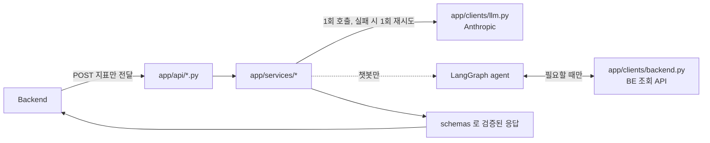

# 맴매 AI 서버

소상공인 매출 데이터로 **매출 예측 · 솔루션 생성 · 매출 인사이트 · 챗봇**을 제공하는 FastAPI
서버다. Backend가 넘겨준 데이터만 쓰고, 서비스 DB에는 직접 접근하지 않는다.

## 기술 스택

- **API**: FastAPI, Pydantic
- **매출 예측**: scikit-learn(Ridge 회귀), pandas, holidays
- **솔루션·인사이트·챗봇**: Anthropic Claude, LangGraph(챗봇 에이전트)
- **패키지 관리**: uv

## 빠른 시작

```bash
uv sync

cp .env.example .env
# .env 에 ANTHROPIC_API_KEY 를 채운다

uv run uvicorn app.main:app --host 0.0.0.0 --port 8000
```

로컬에서 챗봇 툴(BE 조회 API)을 테스트하려면 스텁 서버를 같이 띄운다:

```bash
uv run python devtools/stub_backend.py   # 9000 포트
```

## 테스트 · 린트

```bash
uv run pytest
uv run ruff check --fix . && uv run ruff format .
```

## 엔드포인트

| 경로 | 방향 | 담당 |
|---|---|---|
| `POST /internal/v1/ai/forecast/batch` | BE → AI | 헥터 |
| `POST /internal/v1/ai/solutions/generate` | BE → AI | 제나 |
| `POST /internal/v1/ai/sales-insights` | BE → AI | 제나 |
| `POST /internal/v1/ai/chat/messages` (SSE) | BE → AI | 제나 |

정확한 요청·응답 스펙은 `docs/api정의서.md`·`docs/ERD정의서.md`가 기준 문서다.

## 프로젝트 구조

```
app/
├── main.py              FastAPI 앱 생성, 라우터 등록, 에러 핸들러 등록
├── api/                 HTTP 계층 — 요청 파싱·응답 반환만. 로직 없음
│   ├── solutions.py     POST /internal/v1/ai/solutions/generate
│   ├── insights.py      POST /internal/v1/ai/sales-insights
│   ├── chat.py          POST /internal/v1/ai/chat/messages (SSE)
│   └── forecast.py      POST /internal/v1/ai/forecast/batch      ← 헥터 담당
├── services/            비즈니스 로직 — LLM 호출, 재시도, 파싱·검증
│   ├── solution.py
│   ├── insight.py
│   ├── chat/
│   │   ├── graph.py     LangGraph 에이전트(agent↔tools 사이클)
│   │   └── tools.py     챗봇이 쓰는 BE 조회 툴 4종
│   └── forecast/        Ridge 회귀 예측 파이프라인               ← 헥터 담당
│       ├── features.py  피처 엔지니어링
│       ├── model.py     모델 학습·추론
│       └── service.py   요청→피처→모델→응답 오케스트레이션
├── schemas/              계약의 단일 진실 원천 (Pydantic)
│   ├── common.py         Contract 베이스, Evidence, Metrics — 전 엔드포인트 공유
│   └── solution.py / insight.py / chat.py / forecast.py
├── prompts/              LLM 프롬프트. 파일당 VERSION 상수로 버전을 표시한다
│   ├── solution.py, insight.py, chat.py
├── clients/              외부 호출 래퍼
│   ├── llm.py            Anthropic 단발 생성 (솔루션·인사이트용)
│   └── backend.py        BE 조회 API 4종 호출 (챗봇 툴용)
└── core/
    ├── config.py         환경변수 (pydantic-settings)
    └── errors.py         공통 예외·에러 응답 포맷

devtools/stub_backend.py  로컬 개발용 BE 스텁 서버 (포트 9000)
tests/                    엔드포인트당 테스트 파일 1개 + 공통 테스트
```

**계층 규칙**: `api/` 는 얇게, `services/` 가 로직을 갖는다. 라우터가 LLM을 직접 부르는 코드는
어디에도 없다 — 항상 서비스를 거친다.

### 요청이 흘러가는 길



솔루션·인사이트는 **BE → AI 단방향**(지표 받고 결과 반환)이고, 챗봇만 **AI → BE 역호출**(부족한
지표를 그때그때 조회)이 추가된다. 이 비대칭이 챗봇 쪽 코드(`services/chat/`)가 따로 분리된 이유다.

설계 전략("왜 이렇게 짰는지")과 오늘 반영한 계약 변경 이력은 `docs/ARCHITECTURE.md`에 더 있다.

## 담당 경계 · 작업 규약

- **제나**: `app/api/{solutions,insights,chat}.py`, `app/services/{solution,insight,chat}`,
  `app/clients/`, `app/core/`, `app/prompts/`
- **헥터**: `app/api/forecast.py`, `app/services/forecast/`

브랜치·커밋·PR 규칙, 계약 변경 절차 등 작업 방식 전반은 `AGENTS.md`를 따른다.
