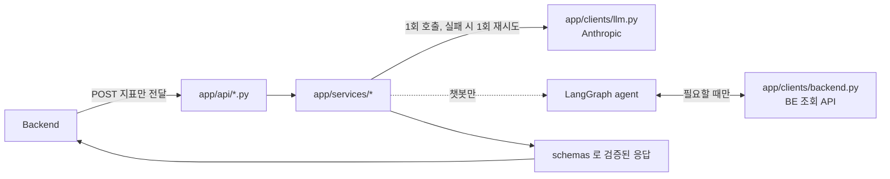

# 맴매 AI 서버 — 구조와 설계 전략

발표용 정리. "왜 이렇게 짰는지"를 코드와 함께 설명한다.

## 1. 한 줄 요약

소상공인 매출 데이터를 받아 **예측·솔루션·인사이트·챗봇**을 만들어주는 FastAPI 서버.
Backend가 넘겨준 데이터만 쓰고, **서비스 DB에 직접 접근하지 않는다.** 계산(숫자)은 전부 코드가
하고, LLM은 그 숫자를 해석해 문장으로 만드는 역할만 한다.

## 2. 디렉토리 구조

```
app/
├── main.py              FastAPI 앱 생성, 라우터 등록, 에러 핸들러 등록
├── api/                 HTTP 계층 — 요청 파싱·응답 반환만. 로직 없음
│   ├── solutions.py     POST /internal/v1/ai/solutions/generate
│   ├── insights.py      POST /internal/v1/ai/sales-insights
│   ├── chat.py          POST /internal/v1/ai/chat/messages (SSE)
│   └── forecast.py      POST /internal/v1/ai/forecast/batch      ← 헥터 담당
├── services/            비즈니스 로직 — LLM 호출, 재시도, 파싱·검증
│   ├── solution.py
│   ├── insight.py
│   ├── chat/
│   │   ├── graph.py     LangGraph 에이전트(agent↔tools 사이클)
│   │   └── tools.py     챗봇이 쓰는 BE 조회 툴 4종
│   └── forecast/        Ridge 회귀 예측 파이프라인               ← 헥터 담당
│       ├── features.py  피처 엔지니어링
│       ├── model.py     모델 학습·추론
│       └── service.py   요청→피처→모델→응답 오케스트레이션
├── schemas/              계약의 단일 진실 원천 (Pydantic)
│   ├── common.py         Contract 베이스, Evidence, Metrics — 전 엔드포인트 공유
│   ├── solution.py / insight.py / chat.py / forecast.py
├── prompts/              LLM 프롬프트
│   ├── solution.py, insight.py, chat.py
├── clients/              외부 호출 래퍼
│   ├── llm.py            Anthropic 단발 생성 (솔루션·인사이트용)
│   └── backend.py        BE 조회 API 4종 호출 (챗봇 툴용)
└── core/
    ├── config.py         환경변수 (pydantic-settings)
    └── errors.py         공통 예외·에러 응답 포맷

devtools/stub_backend.py  로컬 개발용 BE 스텁 서버 (포트 9000)
tests/                    엔드포인트당 테스트 파일 1개 + 공통 테스트
```

**계층 규칙**: `api/` 는 얇게, `services/` 가 로직을 갖는다. 라우터가 LLM을 직접 부르는 코드는
어디에도 없다 — 항상 서비스를 거친다.

## 3. 요청이 흘러가는 길



솔루션·인사이트는 **BE → AI 단방향**(지표 받고 결과 반환)이고, 챗봇만 **AI → BE 역호출**(부족한
지표를 그때그때 조회)이 추가된다. 이 비대칭이 챗봇 쪽 코드(`services/chat/`)가 따로 분리된 이유다.

## 4. 핵심 설계 전략 — 왜 이렇게 짰는가

### 4.1 "계산은 코드, 해석은 모델"

LLM에는 원본 거래 데이터가 아니라 **BE가 이미 계산해 둔 확정 지표**(`Metrics`)만 넘긴다.

```python
# app/schemas/common.py
class Metrics(Contract):
    salesSummary: SalesSummary              # 순매출, 전기 대비 증감률
    hourlyProfile: list[HourlyPoint]        # 시간대별 매출 분포
    categoryBreakdown: list[CategoryPoint]  # 카테고리별 매출 비중·증감률
    predictedSalesToday: int | None = None  # 오늘 예측 매출(예측 모델 결과)
    reviewSummary: dict | None = None       # 리뷰 감성 요약
```

- **환각 방지**: LLM이 매출 합계나 증감률을 직접 계산하게 두면 숫자를 틀리게 만들어낼 위험이 있다.
  계산은 코드가 하고, LLM은 "이미 맞는 숫자"를 문장으로 바꾸기만 한다.
- **입력 토큰 절감**: 원본 거래 수백~수천 건 대신 집계된 지표 몇 개만 보낸다.
- 이 원칙 때문에 `app/prompts/*.py`의 시스템 프롬프트는 전부 "아래 지표만 근거로 사용하고,
  직접 계산하거나 새로운 수치를 만들지 마세요"로 시작한다.

### 4.2 LLM 호출은 최소한으로, 실패 처리는 결정론적으로

- **솔루션 카드 3장을 1회 호출로 동시 생성한다** (`app/services/solution.py`). 카드별로 3번
  나눠 부르면 지연·비용이 3배가 되고, 각 호출이 서로를 모르니 조언이 중복된다. 한 번에 뽑으면
  "1번이 오후 시간대를 다뤘으니 2번은 다른 각도로"가 가능하다.
- **파싱 실패 시 재시도는 1회로 제한**한다(`MAX_RETRY = 1`, solution/insight 공통). 무한 재시도는
  응답 시간을 예측 불가능하게 만든다. 최종 실패는 `500`으로 명확히 알린다.
- **챗봇 툴 실패는 2회까지**(`app/services/chat/graph.py`의 `MAX_TOOL_FAILURES`). 2회 연속
  실패하면 `agent` 노드로 더 돌지 않고 고정 실패 문구(`FAILURE_PHRASE`)를 즉시 반환해 무한 루프를
  막는다.
- **재호출 대신 코드 검증**: 숫자가 맞는지 확인하려고 LLM을 한 번 더 부르지 않는다(비용 2배, 결과도
  불안정). 대신 입력 단계에서 계산을 원천 차단하는 쪽으로 설계했다.

### 4.3 계약은 스키마 하나로 관리한다

`app/schemas/`가 BE와의 계약을 코드로 표현한 **단일 진실 원천**이다.

```python
# app/schemas/common.py
class Contract(BaseModel):
    model_config = ConfigDict(extra="ignore", populate_by_name=True)
```

`extra="ignore"`가 핵심이다. BE와 AI는 **따로 배포되는 서버**라서, 한쪽이 필드를 먼저 추가해도
다른 쪽이 모르는 필드를 만났다고 요청 전체를 422로 막아버리면 배포 순서에 서로 묶인다. 정의 안 된
필드는 조용히 무시하고, 필수 필드 누락만 422로 막는다.

응답 형식도 전부 이 원칙 위에서 통일했다 — 성공은 `{"message": "...", "data": {...}}`,
실패는 `{"message": "...", "failReason"?: "..."}`. `traceId`처럼 노션 계약에 없는 필드는 뺐다
(`app/core/errors.py`).

### 4.4 챗봇만 다른 구조 — LangGraph 에이전트

솔루션·인사이트는 "지표 받고 → LLM 1번 → 반환"으로 끝나지만, 챗봇은 **질문에 답하는 데 필요한
지표가 무엇일지 미리 알 수 없다.** 그래서 챗봇만 LangGraph로 `agent ↔ tools` 사이클을 돌린다.

```python
# app/services/chat/graph.py (개념 구조)
graph.add_conditional_edges("agent", _route_after_agent, {"tools": "tools", END: END})
graph.add_conditional_edges("tools", _route_after_tools, {"agent": "agent", "give_up": "give_up"})
```

- 화면에 이미 떠 있는 솔루션 컨텍스트만으로 답할 수 있으면 **툴을 부르지 않고 바로 답한다.**
- 부족할 때만 `app/services/chat/tools.py`의 BE 조회 툴(매출요약/카테고리/시간대/예측)을 부른다.
- `storeId`는 LLM에게 고르게 하지 않고 클로저로 고정해서, 엉뚱한 매장 데이터를 조회할 여지를
  없앴다.
- 대화 이력은 LangGraph의 checkpointer가 아니라 **BE가 `history` 파라미터로 넘겨준다.** 그래프
  실행 상태와 화면 표시용 메시지는 용도가 달라서(소유권 검증·보관 기간 등은 BE 책임), 굳이 AI 쪽에
  상태를 들고 있지 않는다.

응답은 SSE(`text/event-stream`)로 나간다. 지금 구현은 **완성된 답변을 만든 뒤 40자 단위로 잘라
보내는 방식**이다(진짜 토큰 스트리밍은 다음 개선 과제 — `docs/STATE.md` 참고). 대신 이 방식
덕분에 그래프 실행 중 생긴 오류(502/504/500)가 스트림이 열리기 **전에** 일반 HTTP 에러로 깔끔하게
나간다.

### 4.5 테스트 — LLM·BE 호출은 항상 가짜로 막는다

실제 Claude API나 BE 서버를 두드리는 테스트는 없다. `monkeypatch`로 항상 대체한다.

```python
# tests/test_solutions.py
async def fake_complete(system, user, max_tokens=2000) -> str:
    return LLM_SUCCESS


monkeypatch.setattr(llm, "complete", fake_complete)
```

각 엔드포인트마다 최소 3가지를 검증한다: 정상 경로(200), 필수 필드 누락(422), 도메인 실패
(예: LLM 파싱 계속 실패 → 500, 재시도 정확히 1회). 서버 간 인증을 앱 레벨에서 제거하면서 요청에
인증 헤더를 아예 안 붙이는 걸로 테스트도 단순해졌다(전엔 401 테스트가 있었다).

## 5. 알려진 미완성 지점 (정직하게 공유할 것)

- **챗봇 진짜 토큰 스트리밍 아님** — 완성된 답을 잘라서 보낸다 (4.4절).
- **챗봇 "데이터 부족" 상태를 코드로 판정 못함** — 예측·인사이트처럼 `200 + INSUFFICIENT_DATA`로
  통일하기로 했지만, 그걸 판단할 신호가 챗봇 요청엔 없다. 지금은 LLM이 프롬프트 지시로 자연어로만
  표현한다.
- **솔루션 요청 `metrics`에 순이익·리뷰 요약 필드가 없다** — 설계 설명엔 포함된다고 돼 있는데
  스키마엔 없어서, BE가 보내도 `extra="ignore"`로 조용히 버려진다.

## 6. 배포 로드맵 — v1 → v2 → v3

BE api정의서 기준. 같은 엔드포인트(`POST .../solutions/generate`)에 지표를 선택 필드로
얹어가는 방식이라 클라이언트 변경이 최소화된다.

| 배포 | 버전 | 추가되는 지표/필드 | 비고 |
|---|---|---|---|
| 1차 (현재) | v1 | 매출 요약·시간대·카테고리·예측 지표 | 순이익·리뷰 조회는 챗봇 툴로는 있으나 MVP 범위 밖(비활성화) |
| 2차 | v2 | `weatherContext`(날씨), `holidayContext`(공휴일), `districtBenchmark`(상권 벤치마크) | `metrics`에 선택 필드로 추가하는 하위호환 확장. 외부 데이터를 BE가 수집할지 AI가 직접 호출할지는 팀 확정 필요 |
| 3차 | v3 | `reviewContext`(리뷰 분석 결과 — 감성 요약·관련 리뷰) | 리뷰 수집 실패(`FAILED`/`EMPTY`)해도 v2 수준으로 폴백 |
